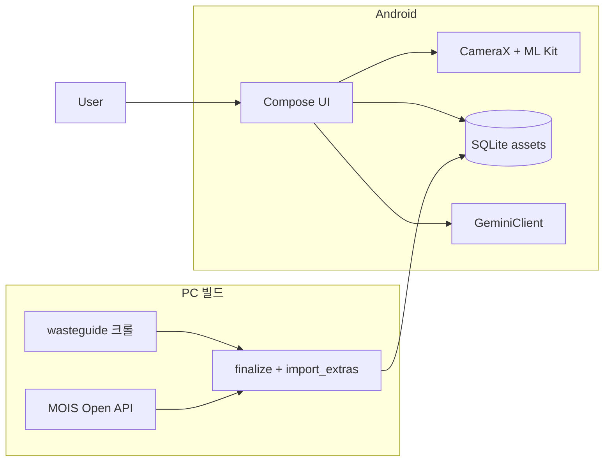
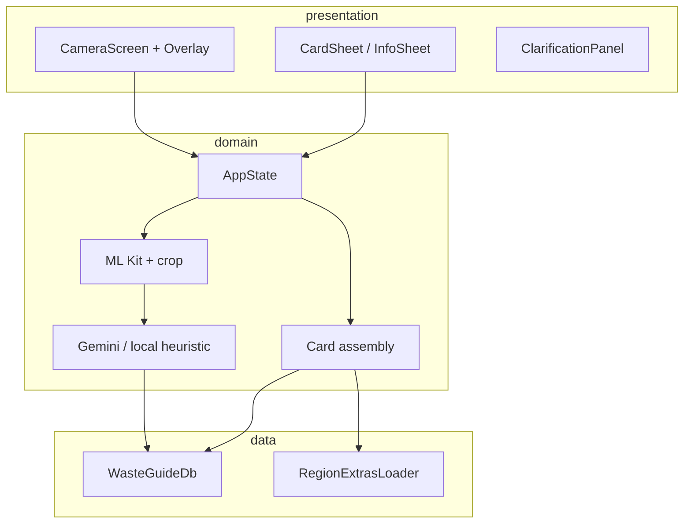
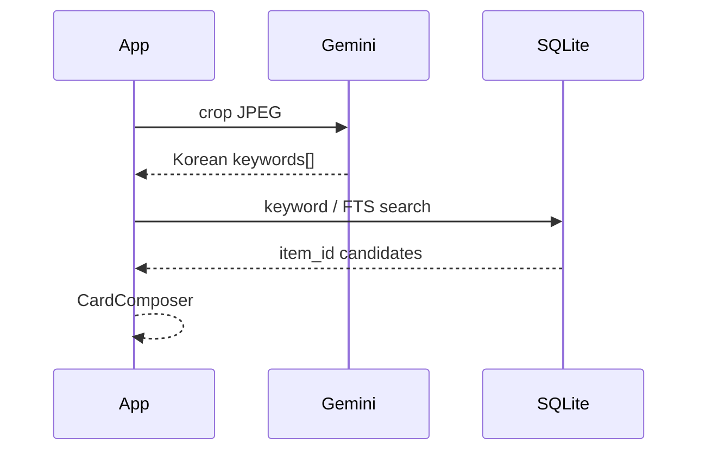

# RecycleAI — Architecture

| 항목 | 내용 |
|------|------|
| 제품 | RecycleAI (TrashAI) |
| 문서 | `PRD.md`, `trd.md`, `problem.md` |
| 상태 | Production Ready (Android) |
| 갱신 | 2026-05-27 |

---

## 1. 목표

1. **오프라인 우선**: 품목·조례·배출 일정·문의처는 번들 SQLite.  
2. **지연 분리**: ML Kit는 기기 내; Gemini는 애매한 크롭만.  
3. **카피 SSOT**: UI 문구는 `app_*` 테이블만.  
4. **불확실성 수렴**: Clarification → `item_id` 확정 후 동일 카드 파이프.

---

## 2. 시스템 맥락



런타임에 **백엔드 DB·Supabase·Edge Function 없음**.

---

## 3. 앱 레이어



| 레이어 | 구현 |
|--------|------|
| Presentation | `CameraScreen.kt`, `CardSheet.kt`, `ClarificationPanel.kt` |
| Domain | `AppState.kt` — 시트 상태, 스캔·매칭 오케스트레이션 |
| Data | `WasteGuideDb.kt`, `RegionExtrasLoader.kt` |
| Infra | `GeminiClient`, `LocationHelper`, 권한 |

---

## 4. 인식 → 카드 플로우

### 4.1 정상 경로

1. ML Kit가 객체 박스·트래킹 ID 제공.  
2. 사용자 탭 또는 드래그 크롭 → JPEG.  
3. 로컬 검색 또는 Gemini 키워드 → `app_search_keyword` / 품목.rule.  
4. `LocationHelper` → `sido`/`sigungu` → `region_code`.  
5. `app_item_rule` + `app_region_ordinance` + `RegionExtrasLoader`(MOIS·연락처).  
6. `SheetState.GuidanceReady` — 픽토그램·요일·전화 링크.

### 4.2 Gemini Grounding



LLM 자연어를 카드 본문으로 쓰지 않음.

### 4.3 Clarification

- 진입: 낮은 신뢰도, 사용자 「틀림」, 빈 매칭.  
- `app_search_keyword` + 허용 후보만 재랭킹.  
- 확정 `item_id` 후 §4.1과 동일.

---

## 5. 로컬 DB (앱)

| 테이블 | 용도 |
|--------|------|
| `app_item_rule` | 품목 카드 |
| `app_region_ordinance` | 지자체 조례 |
| `app_mois_disposal` | 배출 요일·시간 (`sigungu_code` = 5자리 region) |
| `app_region_contact` | 문의 전화 |
| `app_search_keyword` | Clarification |
| `app_common_guide` | E-순환 등 |
| `app_region_mois_map` | 매핑 스냅샷(디버그·재import) |

원천 크롤 테이블(`dictionary_item`, `region_ordinance`)은 PC DB에만 유지, 앱 번들은 `app_*` 중심.

**빌드 순서**

```bash
finalize_app_db.py → build_region_mois_map.py → import_region_extras.py
→ app/src/main/assets/wasteguide.sqlite3
```

---

## 6. 지역·MOIS 코드

| 코드 | 길이 | 사용처 |
|------|------|--------|
| `region_code` | 5 | wasteguide, 앱 조회 키 |
| `mois_sigungu_cd` | 7 | MOIS API 요청 (import 시만) |

`build_region_mois_map.py`: 엑셀 이름 매칭 → 없으면 `region_code + "00"` → `region_mois_code_overrides.json`.

---

## 7. UI 상태

`AppState` / `SheetState`: Idle, Loading, GuidanceReady, Error, Clarifying 등.

바운딩 박스:

- `NeonGreen` — ML Kit 추적  
- `NeonOrange` — 사용자 드래그 + 「이 영역 분석」

---

## 8. 관측·품질

- 로그: PII·원본 영상 저장 금지 (정책)  
- 통계 후보: 매칭 경로(local/gemini), Clarification 턴 수, MOIS 행 유무

---

## 9. 보안

- `GEMINI_API_KEY`: `local.properties` → `BuildConfig` (저장소에 커밋 금지)  
- 카메라·위치 권한: Play 정책 고지  
- 법적 고지: 조례·품목 출처 표기

---

## 10. 확장

- DB: 앱 업데이트로 assets 교체  
- iOS: Presentation 교체, Data/Domain 유지  
- STT: Infrastructure 레이어 추가 (미구현)

---

## 변경 이력

- **2026-05-27**: ML Kit + 번들 SQLite + Gemini-only 클라우드. Supabase·YOLO·런타임 MOIS 제거 반영.  
- **2026-05-14**: 초안 (Clarification, PRD 정합).
